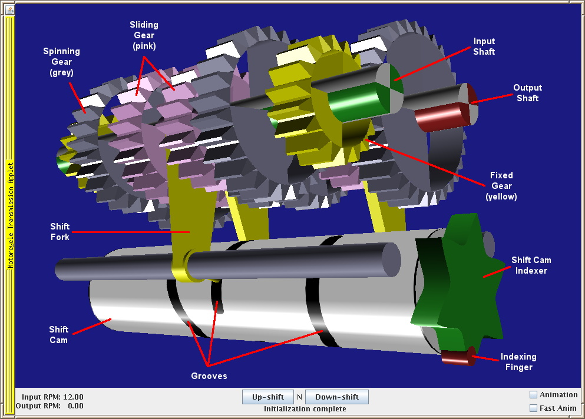

# GearBox
Graphic simulation of a motorcycle transmission using Java 3D.

This is a NetBeans project.

Parts of the display:
* Green shaft: Power input shaft, connected to the engine through the clutch
* Red shaft: Power output shaft, connected to the chain sprocket
* Yellow gears: Solidly mounted to the shaft
* Pink gears: Can slide on the shaft, but spin with it - sliding is controlled by the shift forks
* Grey gears: Can spin freely (unless pinned by the dogs on a sliding gear) but not slide.
* Large grey cylinder: Shift cam, turned by the foot pedal linkage, and controls the shift forks via deep grooves

The gears currently transmitting power are shaded red.

Controls:
* Rotate: Left mouse button
* Zoom: Middle mouse button
* Pan: Right mouse button

To run this on your computer:
* Download and install the Java Runtime Environment from https://java.com/download/  Make sure to not let it install unwanted browser toolbars or change your browser search engine.
* Download Java 3D from https://java3d.java.net/binary-builds.html and install as per the README-unzip.html file. This is rather a pain if you're using Windows.
* Download dist/GearBox.jar
* Run "java -jar GearBox.jar" in a DOS or xterm window.

And people wonder why Java 3D never took off... sheesh.

